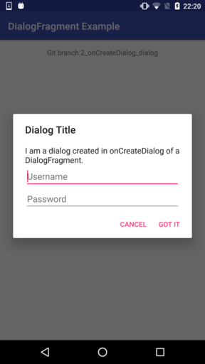

Android DialogFragment Example
==============================

Example app showing how to create dialogs with DialogFragment.

Table of Contents
-----------------

<!-- START doctoc generated TOC please keep comment here to allow auto update -->
<!-- DON'T EDIT THIS SECTION, INSTEAD RE-RUN doctoc TO UPDATE -->

- [Usage](#usage)
- [Branches](#branches)
- [Dialogs Without DialogFragment](#dialogs-without-dialogfragment)
- [Dialogs With DialogFragment](#dialogs-with-dialogfragment)
  - [Advantages](#advantages)
  - [Ways to create the UI of a DialogFragment](#ways-to-create-the-ui-of-a-dialogfragment)
  - [Ways to display a DialogFragment](#ways-to-display-a-dialogfragment)
  - [Combinations](#combinations)
- [References](#references)

<!-- END doctoc generated TOC please keep comment here to allow auto update -->

Usage
-----

1. Import project into Android Studio
2. Switch to the desired Git branch
3. Hit *Run*

Branches
--------

Each branch contains a fully working configuration:

- [1_bare_bones_dialog](https://github.com/weibeld/AndroidDialogFragmentExample/tree/1_bare_bones_dialog): direct creation of an AlertDialog with AlertDialog.Builder (no usage of DialogFragment)
- [2_onCreateDialog_dialog](https://github.com/weibeld/AndroidDialogFragmentExample/tree/2_onCreateDialog_dialog): creation of an AlertDialog with AlertDialog.Builder in onCreateDialog of DialogFragment, and displaying of the DialogFragment as a dialog
- [3_onCreateDialog_fragment](https://github.com/weibeld/AndroidDialogFragmentExample/tree/3_onCreateDialog_fragment): creation of an AlertDialog with AlertDialog.Builder in onCreateDialog of DialogFragment, and displaying of the DialogFragment as a fragment (NON-SOLUTION)
- [4_onCreateView_dialog](https://github.com/weibeld/AndroidDialogFragmentExample/tree/4_onCreateView_dialog): creation of a dialog-like UI in onCreateView of DialogFragment, and displaying of the DialogFragment as a dialog
- [5_onCreateView_fragment](https://github.com/weibeld/AndroidDialogFragmentExample/tree/5_onCreateView_fragment): creation of a dialog-like UI in onCreateView of DialogFragment, and displaying of the DialogFragment as a fullscreen fragment

Dialogs Without DialogFragment
------------------------------

The traditional way of creating dialogs is by creating an AlertDialog object with AlertDialog.Builder and displaying it with the AlertDialog's `show` method ([1_bare_bones_dialog](https://github.com/weibeld/AndroidDialogFragmentExample/tree/1_bare_bones_dialog)). However, in this case, the dialog is terminated by screen rations and other activity restarts. Hence this approach is **obsolete**.

Dialogs With DialogFragment
---------------------------

In API level 11 (Android 3.0 Honeycomb) DialogFragment has been introduced. It is basically a fragment managing and holding a dialog. It can display either the dialog it holds (as a dialog), or it can display itself as a fragment.

### Advantages

The advantages of DialogFragment over creating a dialog directly ([1_bare_bones_dialog](https://github.com/weibeld/AndroidDialogFragmentExample/tree/1_bare_bones_dialog)) are:

- The dialog is maintained across screen rotations and other activity restarts
- The same UI can be displayed as a dialog or as an embeddable fragment without changing the code of DialogFragment

### Ways to create the UI of a DialogFragment

There are two ways to implement the UI of a DialogFragment:

1. In **onCreateDialog**: create and return an **AlertDialog**, the dialog can be built with AlertDialog.Builder
2. In **onCreateView**: create and return a **View** which will be used for the dialog or fragment, the view must be defined in a layout XML

The *advantage* of using **onCreateDialog** is that the dialog can be created with AlertDialog.Builder and thus has the look and feel of a standard dialog. The *disadvantage* is that the dialog cannot be displayed as a fragment.

The *advantage* of using **onCreateView** is that the UI can be displayed as either a dialog or a fragment. The *disadvantage* is that the UI cannot be built with AlertDialog.Builder, but must be designed from scratch in a layout XML. That means, if the UI should look like a standard AlertDialog, the layout must be tuned manually to imitate the look and feel of a real AlertDialog.

### Ways to display a DialogFragment

Furthermore, there are two ways to display the UI of a DialogFragment from an activity or fragment:

1. **Display as dialog:**

    ~~~java
    MyDialogFragment dialogFrag = new MyDialogFragment();
    dialogFrag.show(getFragmentManager(), "DialogTag");
    ~~~

2. **Display as fragment:**

    ~~~java
    MyDialogFragment dialogFrag = new MyDialogFragment();
    FragmentTransaction fragTrans = getFragmentManager().beginTransaction();
    fragTrans.add(android.R.id.content, dialogFrag).commit();
    ~~~

### Combinations

This results in four combination. The following illustrates the effects of these combinations and indicates the branches of this repository that correspond to them:

~~~
                        |                                   |                                 |
                        | 1. Create UI in onCreateDialog    | 2. Create UI in onCreateView    |
                        |                                   |                                 |
------------------------+-----------------------------------+---------------------------------+
                        | Display dialog                    | Display fragment in dialog form |
 1. Display as dialog   |                                   |                                 |
                        | Branch: 2_onCreateDialog_dialog   | Branch: 4_onCreateView_dialog   |
------------------------+-----------------------------------+---------------------------------+
                        | Nothing is displayed              | Display fragment                |
 2. Display as fragment |                                   |                                 |
                        | Branch: 3_onCreateDialog_fragment | Branch: 5_onCreateView_fragment |
------------------------+-----------------------------------+---------------------------------+
~~~

- **Top-left:** the AlertDialog which was created in onCreateDialog is displayed.
- **Bottom-left:** no content is set for the fragment, because onCreateView is not implemented, so nothing is displayed; onCreateDialog is not called.
- **Top-right:** the fragment, whose View is defined in onCreateView, is displayed in the form of a dialog.
- **Bottom-right:** the fragment, whose View is defined in onCreateView, is displayed as a normal fragment.

References
----------

- https://developer.android.com/guide/topics/ui/dialogs.html
- https://developer.android.com/reference/android/app/DialogFragment.html
- https://material.google.com/components/dialogs.html

